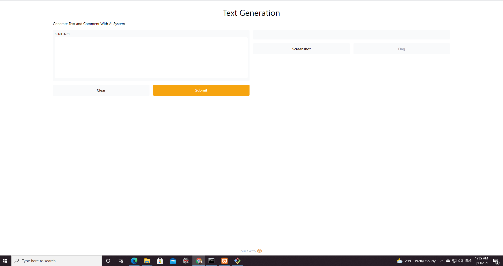
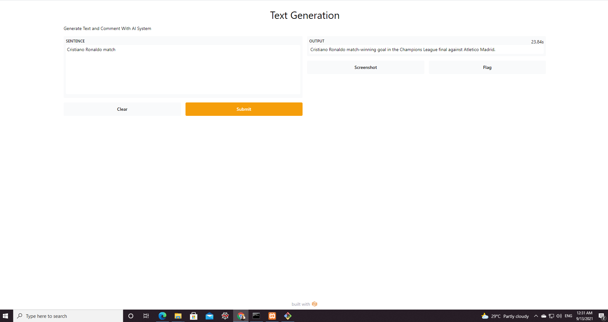
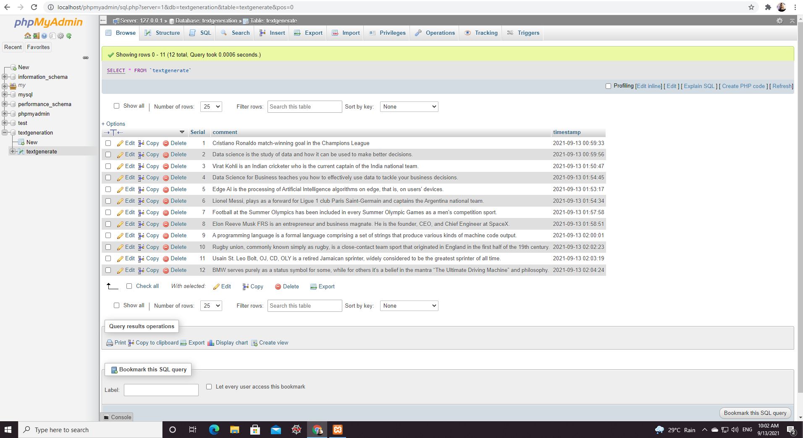
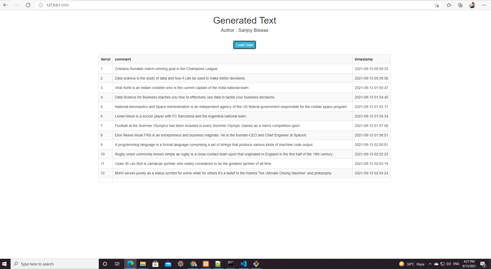

[](https://github.com/imsanjoykb/Text-Generation/)
[](https://github.com/imsanjoykb/Text-Generation/LICENCE.txt)


[](https://github.com/imsanjoykb/Text-Generation/blob/master/Text_Generation.ipynb)


# Author: Sanjoy Biswas

Data Scientist | Machine Learning Engineer </br>
Website: https://imsanjoykb.github.io/ </br>
ResearchGate: https://www.researchgate.net/profile/imsanjoykb </br>
Linkedin: https://www.linkedin.com/in/imsanjoykb/ </br>
Email: sanjoy.eee32@gmail.com <br>

<hr>


## Objective

The goal of this project is to detect the topic of the text and write a proper comment for the text , store the generate comment in database and shows it with rest API.

<hr>

## Background

Text generation is an application of language modeling, and a subfield of natural language processing. It utilizes techniques in artificial intelligence to automatically generate natural language text, which fits in a certain communication context.

Text generation can be used to write stories, poems, emails, news articles, and more. It is also useful for machine translation.

<hr>

## Project Installation

<b>Install the virtualenv package</b>
```
pip install virtualenv  
```
<b>Create the virtual environment</b>
```
virtualenv venv 
```
<b>Activate the virtual environment</b>
```
mypthon\Scripts\activate
```
<b>Install Dependencies</b>
```
pip3 install -r requirements.txt
```
<b>Run the text generation code which redirect userinterface of Gradio and the input of the text generate datafile</b>
```
python Text_Generation.py
```
<b>After this, run main.py file which scale the data and connect with database to store data at DB</b>
```
python main.py
```
<b>Then run app.py file which shows all data and also Gradio </b>
```
python app.py
```

<hr>

## Project GUI
Gradio Interface for text generation:<br>



Shows Generated output:<br>



Store Data at Database:<br>



Shows generated data with timestamp in GUI:<br>



<hr>

## Citing
```
@misc{AI Text Generation,
  author = {Sanjoy Biswas},
  title = {Detect the topic of the text and write a proper comment for the text,  store the generate comment in database and shows it with rest API.},
  year = {2021},
  publisher = {GitHub},
  journal = {GitHub repository},
  url="https://github.com/imsanjoykb/Text-Generation",
}
```


